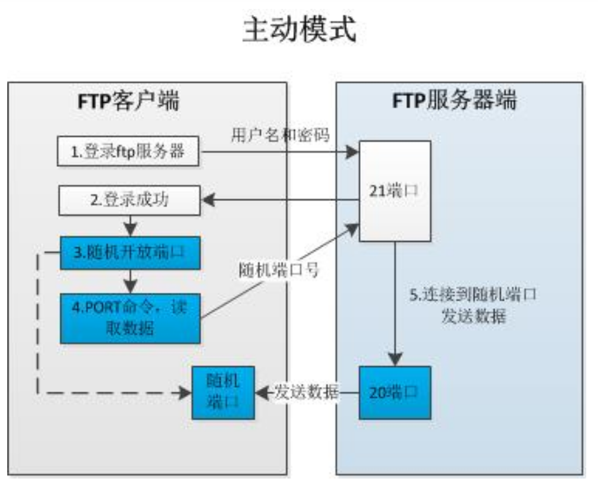
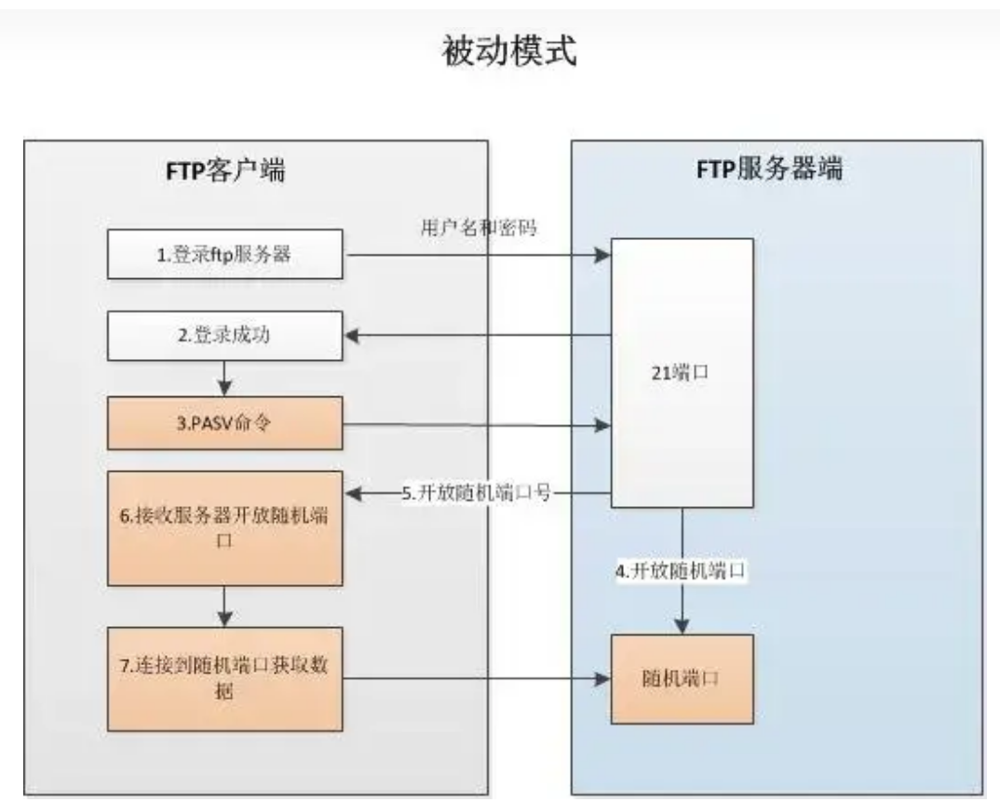

# FTP (File Transfer Protocol)

>* 一种基于TCP的文件传输协议。
>* `FTP`协议有两种工作模式：`PORT`主动模式、`PASV`被动模式。
>* FTP 默认使用`21`和`20`两个端口：前者为命令端口（或控制端口），后者为数据端口。但根据工作模式的不同，数据端口并不固定。
>* `FTP`协议支持`ASCLL`（文本）、`Binary`（二进制）两种方式进行数据传输。若数据传输的不同端点所使用的系统计算机字节位数不一致，那么需要指定使用`Tenex`模式进行。默认`FTP`使用`ASCLL`进行传输。

## `FTP`工作模式

### 主动模式工作原理

* ->`FTP`客户端向`FTP`服务器请求连接
* ->`FTP`客户端发送`FTP`用户名、密码进行登录
* ->`FTP`服务端返回登陆状态
* ->`FTP`客户端若登陆成功，本地将会随机开放一个端口，告知服务器客户端采用主动模式`PORT`并向服务端请求可见数据
* ->`FTP`服务器收到`PORT`请求和开放的端口号后，通过服务器`20`端口向客户端开放的端口号传输数据。

### 被动模式工作原理

* ->`FTP`客户端向`FTP`服务器请求连接
* ->`FTP`客户端发送`FTP`用户名、密码进行登录
* ->`FTP`服务端返回登陆状态
* ->`FTP`客户端若登陆成功，本地将会随机开放一个端口，告知服务器客户端采用被动模式`PASV`并向服务端请求可见数据
* ->`FTP`服务端会在本地开放一个数值大于`1024`的端口，并将开放的端口号告知客户端。
* ->`FTP`客户端后续于服务器新开放端口建立连接，并进行数据传输。

## 总结
>
> 主动模式是由服务器向客户端发起连接，被动模式是由客户端向服务端发起连接。
> 被发起连接方需要开放端口给连接方，在外网环境下，需要考虑防火墙、外网IP、开放端口等问题。

# FTPS （SSL，Secure Sockets Layer）

>* `FTPS`在`FTP`的基础上通过`SSL`对连接通道进行加密，确保了数据的安全性。

## `FTPS`传输模式

### `FTPS隐式SSL`

* 该模式默认使用990端口，在当前模式下，所有数据交互都基于客户端与服务器建立SSL会话。

### `FTPS显示SSL`

* 显示模式支持`FTP`以及`FTPS`两种协议。
* 在会话开始前，客户端需要先与`FTP`服务器建立未加密连接。 并在用户凭证发送前，先发送 `AUTH TLS` 或 `AUTH SSL` 命令请求服务器将命令通道切换为 `SSL` 加密通道。
* 成功建立`SSL`通道后，发送用户凭证进行验证。确保会话期间所有命令都受到`SSL` 通道加密保护。

### 工作流程

* 在握手阶段，客户端与服务器之间建立安全连接。具体步骤如下：

  * ① 客户端连接到服务器的默认 FTP 端口（ 21 端口）。

  * ② 服务器返回一个欢迎消息，并要求客户端协商使用 TLS/SSL 。

  * ③ 客户端发起 TLS/SSL 握手请求。

  * ④ 服务器验证客户端的身份，并发送证书给客户端。

  * ⑤ 客户端验证服务器的证书，并生成一个用于加密通信的密钥。

  * ⑥ 握手完成后，客户端与服务器之间的通信将采用 TLS/SSL 加密。

* 握手阶段完成后，数据传输阶段将客户端与服务器之间的数据传输将通过 TLS/SSL 加密进行保护。具体步骤如下：

  * ① 客户端发送命令请求到服务器，如上传、下载文件等。

  * ② 服务器响应客户端的命令请求，并准备进行数据传输。

  * ③ 客户端与服务器建立一个新的数据连接。

  * ④ 数据连接通过 TLS/SSL 加密进行保护。

  * ⑤ 客户端与服务器之间传输数据。

  * ⑥ 数据传输完成后，数据连接被关闭。

### FTPS 总结

* `SSL隐式模式` 会将`FTP`默认端口改为990。服务器会自动与客户端建立安全连接。
* `SSL显示模式`不会修改`FTP`默认端口，但是需要使用`AUTH SSL` 或 `TLS` 命令主动向服务器请求安全连接后，才可以传输数据。

# SFTP (SSH File Transfer Protocol)
>
>* 基于`SSH`协议之上的安全文件传输协议。

* `SFTP`数据传输方式：
  * 当`SFTP`客户端与服务器请求建立连接时，首先会建立一个`SSH`连接，并加密后续的数据传输。
  * `SFTP` 不同于`FTPS`是在`FTP`的基础上添加了`SSL`。`SFTP` 不使用`FTP`概念中的命令通道或是数据通道。所有命令和数据通过`SSH`建立的单独连接已特殊格式的数据包进行交互。
  
* `SFTP` 提供了两种验证连接的方法:
  * 通过验证用户ID以及密码。
  * 使用SSH密钥进行验证。
